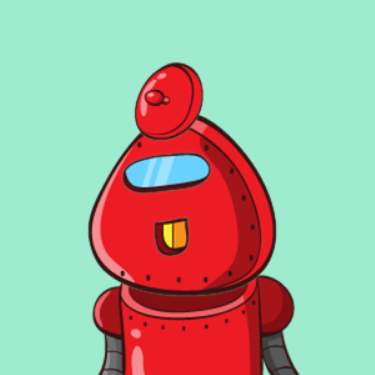

<a name="readme-top"></a>

<!-- PROJECT LOGO -->
<br />
<div align="center">
  <a href="https://github.com/Okazakee/ZTM-robofriends">
    
  </a>

  <h3 align="center">Robofriends</h3>

  <p align="center">
    Search for your Robofriends!
    <br />
    <a href="https://robofriends-okazakee.netlify.app/">View Live Demo</a>
  </p>
</div>

<!-- ABOUT THE PROJECT -->
## About The Project

![Project screenshot][project-screenshot]

This is the first ReactJS website project committed from the [ZTM Web Development Course](https://www.udemy.com/course/the-complete-web-developer-zero-to-mastery/).

### Built With

These are the major frameworks/APIs used in this project.

[![ReactJS][ReactJS]][ReactJS-url]
[![Jsonplaceholder][Jsonplaceholder]][Jsonplaceholder-url]
[![Robohash][Robohash]][Robohash-url]

## How it works
The website lets you search between various robots by their data, fetched from a fakeApi (jsonplaceholder) with images provided by Robohash API.

<!-- GETTING STARTED -->
## Getting Started

* Clone the repo:
```bash
git clone https://github.com/Okazakee/ZTM-robofriends.git
```

* Install dependencies:
```bash
npm -i
# or
yarn
```

* Run the development server:

```bash
npm run start
# or
yarn start
```

<!-- MARKDOWN LINKS & IMAGES -->
<!-- https://www.markdownguide.org/basic-syntax/#reference-style-links -->
[project-screenshot]: assets/screenshot.png

[ReactJS]: https://img.shields.io/badge/ReactJS-000000?style=for-the-badge&logo=react&logoColor=white
[ReactJS-url]: https://react.dev/

[Robohash]: https://img.shields.io/badge/robohash-222d3d?style=for-the-badge&logo=data:image/png;base64,iVBORw0KGgoAAAANSUhEUgAAADIAAAAyCAMAAAAp4XiDAAAABGdBTUEAALGPC/xhBQAAAAFzUkdCAK7OHOkAAAAJcEhZcwAAEnQAABJ0Ad5mH3gAAAC9UExURUdwTP///39qacm/v////////8a9vLqwsNDJyf////////Dw8fLy86ipqv////P09f3+//j5+/n7/fb296Wmp5iJiZ2Pjufl5n5tbIZ2daytr3RnaKKYmLOoqI9+fuzr7cC5uWlUVXVgX8rDw+Hd3drX2tbR0aibncO/wFhERFU7OjMSFrG0tZCIiEovKD8gIhsACa2hoHZyc0E5RevcJ62cdrqjJMOwJt7MHv/2J///MaqSD/LlMvzwMaeQI5rFhZcAAAALdFJOUwCv769wSM/+/hy/X8WnlwAAAjtJREFUSMft1Mdy4zAMBmBtyUpeEGAX1auL3J1etrz/Y+UQO9FsGXOvO8H9488BSATBe73Xf1y9rez8X0CSNkw0+XLqndBJoQHEsPE1UUwAAADSbFZ+JCX5QvjMFLGPsEpKLqVSSkqTtT4kFkrOhjC+vV1Qj7k7L4a6vr1/WB9ubh6/tcyYxXlSusPj/c3Pw/f7H3cHbdCeJ6Hd3z097de7h7v1njKszpOmXK53693q+vo6r+WAqUcKlXme2yKMBHEeYeJBJFHfW5KcAfCZ8SJJweHyZZhs6kV4b+PyOH/mTO5BlJNKCCIBAKz2IX3NQA/dalcJAOZ8LhaUGtT26ipZEgCf+qQEpQTmomjGGQCfG4+5BE3NgGnNGQDowWf6QbA4tgsAZNY5H/LFMTj1uEi8fuUkFkdCzcp3X8RCA5OCwmWcpl3bFh7mspF1mK7WTUiCKFytz2yaSZB2s/JymV/twM1l3RWbYW+TvGsr/jeznJEb6rjtKiqUSzLctBaEEDRLqj8uMbsiDnq+iIo+XCiVZGbTTgUDABBDXv4mPjaUEAAAl1pqKclmmKXzl0kxVm1+WVKTT5aoI3grPd8i4qnpukTcRmNxEZYkC8eBvRJhM5MlpzGJLRocN/zzdEHA7TiE1SkiLl7/W4w4XlIXQUogY9IjIktETPkxVTfGYPb2sidfQ6dBFeMQkAUajNXrAcZg1r1diyoC5gY1JmqLxoSnXBkj4mivf6BKAG8EGxNRIRZzfjrAImKWB8EzIINAAjB5newAAAAASUVORK5CYII=
[Robohash-url]: https://robohash.org/

[Jsonplaceholder]: https://img.shields.io/badge/Jsonplaceholder-ffffff?style=for-the-badge&logo=data:image/svg+xml;base64,PD94bWwgdmVyc2lvbj0iMS4wIiBlbmNvZGluZz0iVVRGLTgiIHN0YW5kYWxvbmU9Im5vIj8+CjwhRE9DVFlQRSBzdmcgUFVCTElDICItLy9XM0MvL0RURCBTVkcgMS4xLy9FTiIgImh0dHA6Ly93d3cudzMub3JnL0dyYXBoaWNzL1NWRy8xLjEvRFREL3N2ZzExLmR0ZCI+CjxzdmcgdmVyc2lvbj0iMS4xIiBpZD0iTGF5ZXJfMSIgeG1sbnM9Imh0dHA6Ly93d3cudzMub3JnLzIwMDAvc3ZnIiB4bWxuczp4bGluaz0iaHR0cDovL3d3dy53My5vcmcvMTk5OS94bGluayIgeD0iMHB4IiB5PSIwcHgiIHdpZHRoPSIxNnB4IiBoZWlnaHQ9IjE2cHgiIHZpZXdCb3g9IjAgMCAxNiAxNiIgZW5hYmxlLWJhY2tncm91bmQ9Im5ldyAwIDAgMTYgMTYiIHhtbDpzcGFjZT0icHJlc2VydmUiPiAgPGltYWdlIGlkPSJpbWFnZTAiIHdpZHRoPSIxNiIgaGVpZ2h0PSIxNiIgeD0iMCIgeT0iMCIKICAgIGhyZWY9ImRhdGE6aW1hZ2UvcG5nO2Jhc2U2NCxpVkJPUncwS0dnb0FBQUFOU1VoRVVnQUFBQkFBQUFBUUNBUUFBQUMxK2pmcUFBQUFCR2RCVFVFQUFMR1BDL3hoQlFBQUFDQmpTRkpOCkFBQjZKZ0FBZ0lRQUFQb0FBQUNBNkFBQWRUQUFBT3BnQUFBNm1BQUFGM0NjdWxFOEFBQUFBbUpMUjBRQS80ZVB6TDhBQUFBSGRFbE4KUlFmbkJnY1RLelNjcGxoMkFBQUFORWxFUVZRb3oyTmdJQkg4Wi9pUEtzQUlGVWJtLzBlVFJkZURZaDVWd1gvc1BDWkMraWhYUUF2MwpvOGtRRmRTb2VrZ05YZ0RjYlEzL1BBRHhOZ0FBQUNWMFJWaDBaR0YwWlRwamNtVmhkR1VBTWpBeU15MHdOaTB3TjFReE9UbzBNem8xCk1pc3dNRG93TU12S0JJWUFBQUFsZEVWWWRHUmhkR1U2Ylc5a2FXWjVBREl3TWpNdE1EWXRNRGRVTVRrNk5ETTZOVElyTURBNk1EQzYKbDd3NkFBQUFBRWxGVGtTdVFtQ0MiIC8+Cjwvc3ZnPgo=
[Jsonplaceholder-url]: https://jsonplaceholder.typicode.com/
